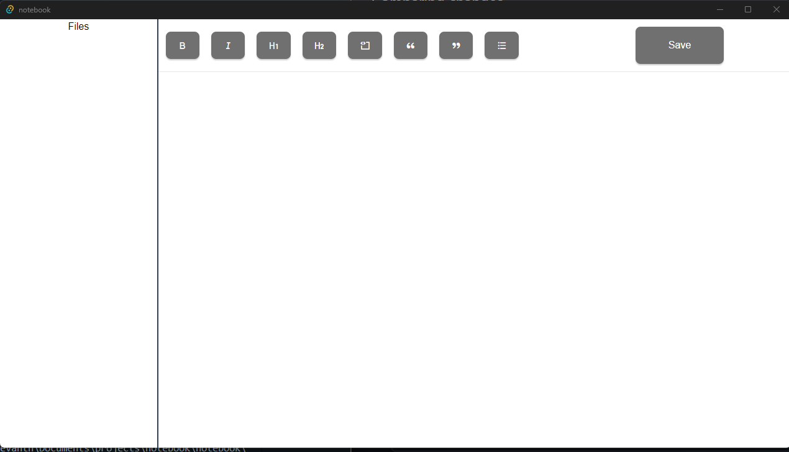

# This a project to build a notepad app for desktop

This will be a simple project which can be used to take down notes in an app for desktop

## Stack used

- React (For frontend)
- Tailwind (For UI styling)
- Tauri (For desktop build)
- Rust (planned to use in the comming time for the backend purpose)

## Features planned

- Options to add bold, italics and basic styling of text
- Add images to the file.
- Adding code blocks
- Ability to save the file.
- Have a root structure of the files create in the main folder.

### Screenshot

